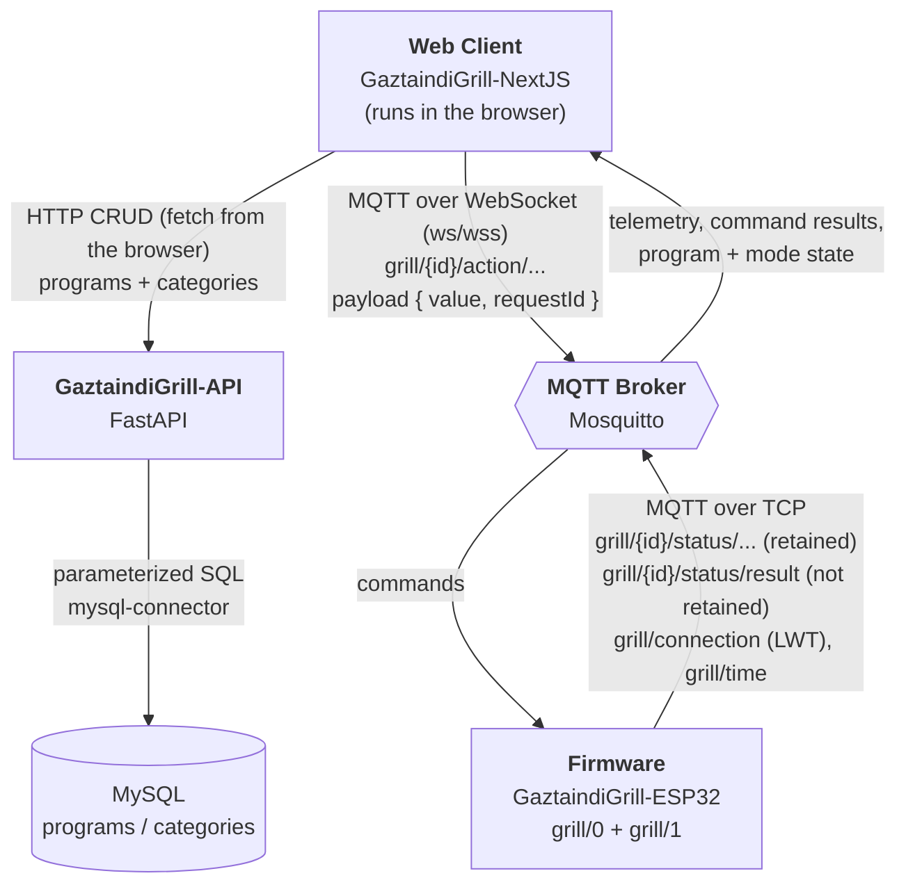

# CLAUDE.md

This file provides guidance to Claude Code (claude.ai/code) when working with code in this repository.

## What this repository is

**GaztaindiGrill** is a monorepo: a remotely-controlled grill (ESP32) driven over MQTT from a web app, with a FastAPI backend for persisting cooking programs. It holds every part of the ecosystem in one git history — firmware, web client, API, and the Home Assistant add-on that packages the API. Each project below has its own CLAUDE.md with project-specific commands.

## Layout

| Path | Role | Stack |
|---|---|---|
| `GaztaindiGrill-ESP32/` | Firmware running on the ESP32 that physically drives the grill (vertical position, rotation/tilt, temperature, cooking programs). | C++ / Arduino framework / PlatformIO |
| `GaztaindiGrill-NextJS/` | Web client used to control the grill in real time and manage programs. | Next.js 15 / React 19 / TypeScript |
| `GaztaindiGrill-API/` | Backend microservice: CRUD for cooking programs/categories (MySQL). | Python / FastAPI |
| `GaztaindiGrill-API/addons/gaztaindigrill_api/` | Home Assistant add-on packaging of the API: `Dockerfile`, `config.yaml`, `run.sh`, `requirements.txt` are hand-authored and tracked; `app/` is a generated mirror of the API's own `app/` and is **gitignored** — see below. | Python / Docker / Home Assistant Supervisor |

### Deploying the API to Home Assistant

`GaztaindiGrill-API/deploy-addon.ps1` automates the whole path — **do not copy files by hand**:

1. Mirrors `GaztaindiGrill-API/app` onto `GaztaindiGrill-API/addons/gaztaindigrill_api/app` (robocopy `/MIR`, excluding `__pycache__`).
2. Uploads the add-on to the HA host over Samba.
3. Rebuilds and restarts the add-on over SSH (`ha addons rebuild` + `restart`).

Because step 1 mirrors with `/MIR`, **any edit made directly inside `addons/gaztaindigrill_api/app` is destroyed on the next deploy** — it's also gitignored, so such an edit would never even become committable. Change `GaztaindiGrill-API/app` and run the script. The HA host, credentials and add-on slug are hardcoded at the top of the script. `addons/gaztaindigrill_api/requirements.txt` is a separate, hand-maintained copy of the API's `requirements.txt` (the deploy script does not sync it) — update both if a dependency changes.

## System architecture (cross-project)

- **HTTP** is used *only* for CRUD on programs/categories, called straight from the browser (`NEXT_PUBLIC_API_URL`) — there is no Next.js server-side proxy. The API is not in the real-time control loop.
- **MQTT** is used for *everything else*: manual movement/rotation commands, program execution, sensor telemetry, mode switching, and connection status (LWT). This happens directly between the web client and the ESP32 — the API does not relay these messages.
- **The API has no MQTT connection at all** — note there is no edge between it and the broker above. It used to carry a `paho-mqtt` singleton that connected at startup and published nothing (`programs.py` imported `publish` without ever calling it), so it was removed along with the `lifespan`, the `MQTT_*` config, the dependency and the add-on's MQTT options. `GaztaindiGrill-API/docs/architecture.md` §5 records what went and what would have to be decided before reintroducing it.

## Source of truth for the MQTT contract

**`GaztaindiGrill-ESP32/lib/Grill/GrillConstants.h`** is the authoritative definition of every MQTT topic, payload string, error code and protocol constant. When implementing or debugging anything MQTT-related:

1. Check `GrillConstants.h` first.
2. Cross-check against `GaztaindiGrill-NextJS/src/constants/mqtt.ts` (the frontend's mirror of the topics and payloads) and `GaztaindiGrill-NextJS/src/constants/commandErrors.ts` (the frontend's mapping of the firmware's `ERROR_*` codes to Spanish display text).
3. `GaztaindiGrill-NextJS/docs/mqtt.md` is the prose version of the same contract — full topic tables, the request/response envelope, retained-vs-not semantics and the main flows. It was rewritten against the code, so it is accurate, but it is still a *copy*: on any disagreement, `GrillConstants.h` wins.

The contract is duplicated between C++ and TypeScript with nothing enforcing agreement — use the `mqtt-contract-auditor` agent (see below) rather than eyeballing it.

### Topic prefix convention (differs per side — easy to get wrong)

- **Firmware** stores global topics *with* the `grill/` prefix baked in (`TOPIC_LWT = "grill/connection"`) but per-grill topics *without* any prefix (`TOPIC_CMD_PROG_EXECUTE = "action/program/execute"`), prepending `grill/{id}/` at publish time.
- **Frontend** stores *every* topic bare (`LWT: 'connection'`, `EXECUTE: 'action/program/execute'`) and interpolates the prefix at each call site, as a template literal. There is **no central topic-building helper**; the prefix is retyped at ~15 call sites, so a wrong prefix is a per-call-site bug, not a constants bug.

So identical-looking constants in the two files are not directly comparable — compare the *resulting full topic*.

Structure: global topics are flat (`grill/connection`, `grill/restart`, `grill/time`, ...); per-grill topics are namespaced `grill/{id}/...` where `{id}` is `0` or `1` (`NUM_GRILLS = 2`), split into `action/...` (client → ESP32 commands) and `status/...` (ESP32 → client telemetry).

### Request/response envelope

Commands are no longer fire-and-forget. Every command the client sends is wrapped as `{ "value": <payload>, "requestId": "<uuid>" }`, and the ESP32 answers on `grill/{id}/status/result` (QoS 1, **not retained** — it is a reply, not state) with `{ requestId, command, ok, error? }`. Errors are machine codes owned by the firmware (`invalid_json`, `no_steps`, `no_rotor`, `rotation_out_of_range`, `rotation_unsafe`, `mode_change_denied`, `no_program_running`, `encoder_not_answering`); the display wording lives in the client so rewording never requires reflashing. The sentinel `requestId` `"EVERYONE"` means the answer is broadcast to every connected client rather than correlated to one request.

## Per-project documentation

Each project's own docs are more detailed than this overview — read them before making changes in that project:

- `GaztaindiGrill-ESP32/ARCHITECTURE.md` — class structure (Grill, ProgramManager, MovementManager, GrillMQTT, HardwareManager...), the multi-user state-sync flow, and LWT-based disconnect handling. `GaztaindiGrill-ESP32/TODO.md` carries known bugs with detailed reasoning — read it before touching encoder or program-execution code.
- `GaztaindiGrill-API/docs/architecture.md`, `docs/database.md`, `docs/api-reference.md` — service architecture, MySQL schema (`programs`, `categories`), and endpoint reference. §5 of `architecture.md` records why the MQTT publish is still unimplemented.
- `GaztaindiGrill-NextJS/docs/mqtt.md` — the full MQTT contract in prose: topic tables, the `{ value, requestId }` envelope, error codes and the main flows. `docs/cache.md` — how a client that connects mid-cooking gets the whole running program (short version: the retained `status/program/current` topic, not a cache). `docs/api.md` — REST contract with the API. `TODO.md` is a mix of Spanish and Basque.

## Conventions worth knowing

- **One branch covers a whole feature.** Before the monorepo this meant creating and remembering to merge the same branch name in three separate repos by hand; now it's just a branch, same as any other project.
- **Code comments are written in English**, in every project — `.h`/`.cpp`, `.ts`/`.tsx` and `.py` alike. The split is by audience: what a *developer* reads in the source is English (comments, identifiers, log strings, commit messages); what a *user* reads is Spanish (UI copy, `commandErrors.ts` wording, `docs/`, `TODO.md`). Plenty of Spanish comments predate this rule — translate them when you are already editing that code, don't sweep the repo for them.
- **New code copies the file it lands in.** Before writing anything, read what is already around it and match it: comment density, naming, spacing and brace style, how errors are returned, how things are named in Spanish or English. The surrounding file wins over any habit brought in from outside — a change should be hard to spot as new.
- **Comments are short and plain.** One line unless the code truly needs two. Write simple English that any developer on the team can scan at a glance — no idioms, no build-up, no restating the line below. Give the fact or the constraint and stop. If it takes a paragraph, it belongs in the plan file or the commit body, not above the code.
- **Do not comment what the code already says.** A comment earns its place only when it carries something the code cannot: a constraint, a hardware quirk, a reason a tempting alternative was rejected. Obvious code gets none — if the neighbouring lines are bare, the new lines are bare too. Never narrate a change ("added to fix X", "now also handles Y"); that is what the commit message is for.
- **Commits follow Conventional Commits** in English, lowercase after the prefix, describing the behaviour change rather than the file touched: `feat: let programs run their positions relative to the starting point`, `fix: replace curl with a Python OTA uploader in platformio.ini`, `docs: update TODO.md`. Prefixes in use: `feat`, `fix`, `docs`, `refactor`, `chore` (repo-maintenance work rather than product behaviour).
- **A commit can span projects when the change genuinely does** — e.g. a new MQTT error code touching both `GaztaindiGrill-ESP32/lib/Grill/GrillConstants.h` and `GaztaindiGrill-NextJS/src/constants/commandErrors.ts` is one behaviour change and reads better as one commit now that it's possible. Still prefer one concern per commit; don't bundle unrelated work across projects just because the repo allows it.
- **Program steps schema** is shared across firmware, API, and frontend. A step does **one** thing: `action`, `temperature`, `position`, `rotation` or `time` — and `time` alone means a *wait step*, not a delay tacked onto a movement. Movement steps carry no time and advance as soon as they arrive. Units: time in seconds, temperature in °C, position 0-100, rotation 0-360. The program also carries `referenceType` (`absolute` | `relative`). The firmware resolves the type in that order (`ProgramManager::start_current_step()`) and skips a step that has none of them. The API stores the step array as `steps_json` (a JSON string column in MySQL); the frontend treats it as serialized JSON too — don't assume it's structured/typed at the DB level.
- **API request bodies use camelCase** (`stepsJson`, `creatorName`, `categoryId`) while **API responses and the DB schema use snake_case** (`steps_json`, `creator_name`, `category_id`). This asymmetry is intentional per `docs/api-reference.md` — don't "fix" it in one layer without checking the other.
- **No automated test suites exist in any of these projects.** NextJS `package.json` has only `dev`/`build`/`start`/`lint`; `GaztaindiGrill-ESP32/test/` holds nothing but the PlatformIO placeholder README; the API has no pytest. Verification is manual: flash to hardware and watch serial/MQTT traffic, exercise the UI in a browser, hit the API directly. Do not claim a change is "tested" — say how it was verified.
- None of these projects use Cursor or Copilot rule files (`.cursorrules`, `.github/copilot-instructions.md`) — this CLAUDE.md set is the AI-assistance documentation layer for the ecosystem.

## Tooling (`.claude/`)

### The feature workflow

The normal path for anything bigger than a one-liner is four commands, in order. Each ends by naming the next, so there's never a guess about what to run.

| Step | Command | What it does |
|---|---|---|
| 1 | `/feature-plan <what you want>` | Reads the affected projects and docs, then writes a numbered plan of atomic, independently-committable tasks to `.claude/plans/<slug>.md`. Plans only — never writes code. Edit the file directly to correct the plan. |
| 2 | `/feature-implement [n]` | Implements **one** task, verifies it (`pio run` / `npm run lint` / `compileall` — there are no test suites), stages exactly that task's files and proposes its commit message as a runnable command. Stages; never commits. Repeat per task. |
| 3 | `/docs-sync` | Diffs the branch, maps changed paths to the docs that describe them, updates those docs against the real diff, stages them with `docs:` messages. |
| 4 | `/commit` | Lands everything. |

Steps 2 and 3 deliberately stop after each unit of work instead of batching: the point is that reviewing a staged diff stays cheap.

### Everything else

| What | Use it for |
|---|---|
| `/commit [firmware\|next\|api\|all]` | Groups the diff into atomic commits, proposes Conventional Commit messages, commits what you approve. The scope filters by path prefix within this one repo; defaults to everything. Usable standalone, without the workflow above. |
| `mqtt-contract-auditor` agent | Read-only diff of the MQTT contract between `GrillConstants.h` and the frontend's `constants/mqtt.ts` + `commandErrors.ts` + call sites. Run it after touching any topic, payload or error code. |
| `commit-splitter` agent | Reads a diff and returns a commit plan. Invoked by `/commit`; rarely useful standalone. |

## Working agreements

- **Never commit without being asked.** Staging and committing happen when the user runs `/commit` or says so explicitly — not as the tail end of a task.
- **Uncommitted work never blocks new work.** If the user changes direction with a dirty tree, follow them. Don't insist on committing, stashing, or "cleaning up" first, and don't refuse to start something new. Just keep track of what's pending.
- **Don't switch branches on your own.** Branch changes are the user's call.
- **Shell commands you hand the user must be PowerShell 5.1.** That's what they run. `&&` is a parser error there — chain with `; if ($?) { ... }`, and tag the fence `powershell`. Same for `head`/`tail`/`which`/`touch`, which don't exist as such.
