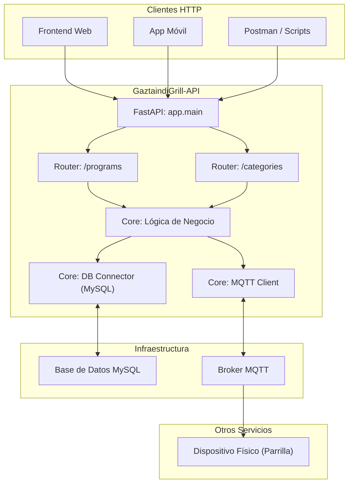

# Arquitectura del Microservicio: GaztaindiGrill-API

Este documento detalla la arquitectura, los componentes y el flujo de datos del microservicio.

## 1. Resumen General

El servicio está construido en **Python** utilizando el framework **FastAPI**, lo que le confiere un alto rendimiento para operaciones I/O asíncronas. Su principal responsabilidad es gestionar las entidades de la parrilla (programas de cocción, categorías) y comunicarse con otros servicios o dispositivos a través de MQTT.

## 2. Diagrama de Componentes

## 3. Componentes Principales

### 3.1. Aplicación FastAPI (`app/main.py`)
- **Descripción**: Es el punto de entrada del servicio. Inicializa la aplicación FastAPI, configura middlewares como CORS y gestiona el ciclo de vida de la aplicación (`lifespan`).
- **Ciclo de Vida**: Utiliza el gestor de contexto `lifespan` para conectarse al broker MQTT al arrancar y desconectarse de forma segura al detener el servicio.
- **Enrutamiento**: Importa e incluye los `APIRouter` de los diferentes dominios de la aplicación (`categories`, `programs`), manteniendo el código de los endpoints modularizado.

### 3.2. Módulo de Rutas (`app/api/routes/`)
- **Descripción**: Contiene la definición de los endpoints HTTP. Cada archivo corresponde a una entidad de negocio.
  - `categories.py`: Endpoints para crear y listar categorías de programas.
  - `programs.py`: Endpoints CRUD (Crear, Leer, Actualizar, Borrar) para los programas de cocción.
- **Flujo**: Reciben las peticiones HTTP, validan los datos de entrada usando esquemas de Pydantic y orquestan la respuesta interactuando con los módulos del `core`.

### 3.3. Módulo Core (`app/core/`)
- **`db.py`**:
  - **Motor**: Utiliza `mysql-connector-python` para la conexión con una base de datos **MySQL**.
  - **Gestión de Conexión**: Proporciona una función `get_connection()` que actúa como un singleton simple para reutilizar la conexión a la base de datos entre peticiones, mejorando la eficiencia. Realiza pings para verificar si la conexión sigue activa.
- **`mqtt_client.py`**:
  - **Librería**: Utiliza `paho-mqtt` para la comunicación MQTT.
  - **Función**: Gestiona una instancia de cliente MQTT global. Se conecta al broker al inicio de la aplicación y permite publicar mensajes en topics específicos.
  - **Caso de Uso Clave**: Al actualizar un programa (`PATCH /programs/{id}`), publica un mensaje en el topic `programs/updated/{program_id}`. Esto sirve como una señal de invalidación de caché para otros servicios o dispositivos (como la propia parrilla) que puedan tener una copia local de los programas.
- **`config.py`**:
  - **Gestión**: Carga las variables de entorno desde un archivo `.env` utilizando `python-dotenv`.
  - **Propósito**: Centraliza el acceso a todos los parámetros de configuración (credenciales de BBDD, datos del broker MQTT), evitando hardcodear valores en la lógica de la aplicación.

### 3.4. Módulo de Esquemas (`app/schemas/`)
- **Tecnología**: Utiliza **Pydantic** para definir los modelos de datos.
- **Función**:
  1.  **Validación**: FastAPI los usa para validar automáticamente los cuerpos de las peticiones (`request body`) en los endpoints `POST` y `PATCH`/`PUT`.
  2.  **Serialización**: Ayudan a formatear y documentar las respuestas de la API.
  - `programs.py`: Define modelos como `CreateProgramRequest` y `UpdateProgramRequest`, especificando los campos y tipos de datos esperados.

## 4. Flujo de Datos (Ejemplo: Actualizar un Programa)

1.  Un cliente envía una petición `PATCH /programs/123` con un JSON en el cuerpo.
2.  **FastAPI** recibe la petición y la dirige al endpoint `update_program` en `app/api/routes/programs.py`.
3.  El `payload` de la petición es validado automáticamente contra el modelo Pydantic `UpdateProgramRequest`.
4.  La función `update_program` construye una consulta SQL `UPDATE` dinámica basada en los campos presentes en el `payload`.
5.  Obtiene una conexión a la base de datos a través de `core.db.get_connection()`.
6.  Ejecuta la consulta SQL para actualizar el registro en la tabla `programs` de **MySQL**.
7.  Si la actualización es exitosa, llama a la función `core.mqtt_client.publish()` para enviar un mensaje al topic `programs/updated/123`.
8.  El **Broker MQTT** reenvía este mensaje a todos los suscriptores, que pueden entonces actuar en consecuencia.
9.  El endpoint responde al cliente con un `HTTP 200 OK` y un mensaje de éxito.
