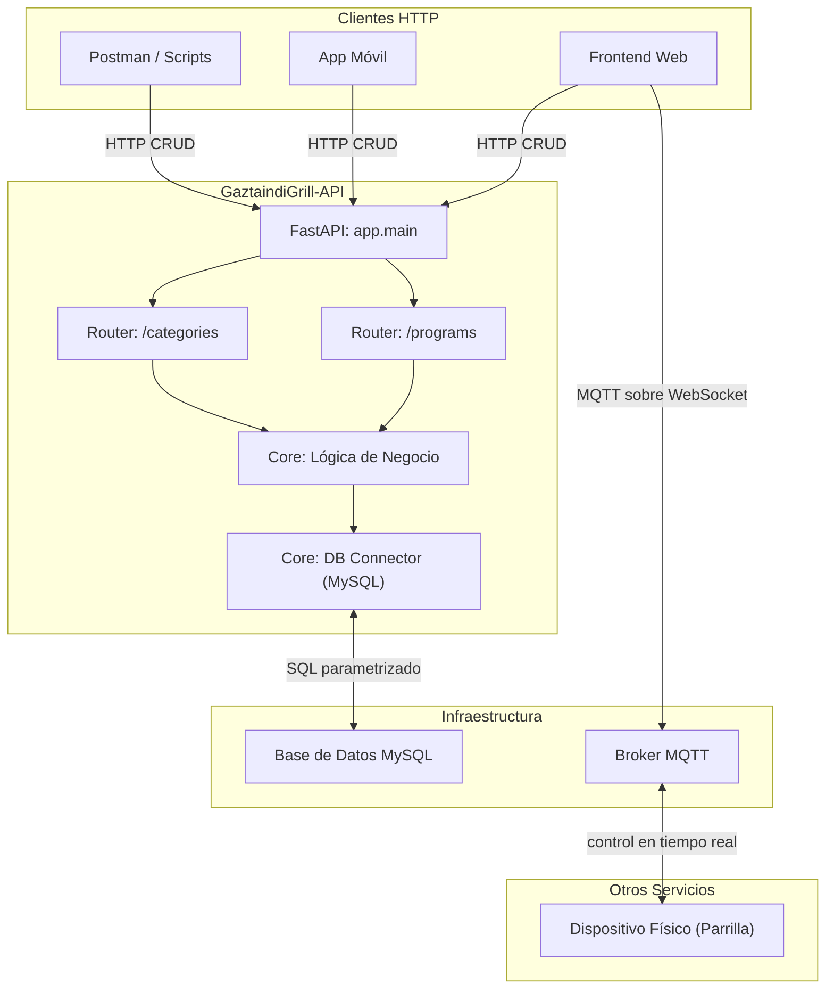

# Arquitectura del Microservicio: GaztaindiGrill-API

Este documento detalla la arquitectura, los componentes y el flujo de datos del microservicio.

## 1. Resumen General

El servicio está construido en **Python** utilizando el framework **FastAPI**, lo que le confiere un alto rendimiento para operaciones I/O asíncronas. Su única responsabilidad efectiva es **gestionar las entidades de la parrilla** (programas de cocción, categorías) sobre MySQL.

> **El servicio no habla MQTT en absoluto.** El movimiento manual, la ejecución de programas y toda la telemetría viajan directamente por MQTT entre el cliente web y la parrilla, sin pasar por aquí. Ver `GaztaindiGrill-NextJS/docs/mqtt.md`.
>
> Este servicio es **puramente HTTP + MySQL**. Si buscas el cliente `paho-mqtt` que hubo aquí, se eliminó: ver §5.

## 2. Diagrama de Componentes

Fíjate en que **no sale ninguna arista de la API hacia el broker**: el recuadro de la API y el mundo MQTT solo se tocan a través del frontend, que es cliente de ambos.

## 3. Componentes Principales

### 3.1. Aplicación FastAPI (`app/main.py`)
- **Descripción**: Es el punto de entrada del servicio. Inicializa la aplicación FastAPI y configura middlewares como CORS.
- **Ciclo de Vida**: No hay gestor `lifespan`. Lo hubo, y su única función era conectar y desconectar el cliente MQTT; al eliminarse este (§5) se quedó vacío y se retiró. La conexión a MySQL no lo necesita: `db.get_connection()` la abre perezosamente y la reutiliza.
- **Enrutamiento**: Importa e incluye los `APIRouter` de los diferentes dominios de la aplicación (`categories`, `programs`), manteniendo el código de los endpoints modularizado.

### 3.2. Módulo de Rutas (`app/api/routes/`)
- **Descripción**: Contiene la definición de los endpoints HTTP. Cada archivo corresponde a una entidad de negocio.
  - `categories.py`: Endpoints para crear y listar categorías de programas.
  - `programs.py`: Endpoints CRUD (Crear, Leer, Actualizar, Borrar) para los programas de cocción.
- **Flujo**: Reciben las peticiones HTTP, validan los datos de entrada usando esquemas de Pydantic y orquestan la respuesta interactuando con los módulos del `core`.

### 3.3. Módulo Core (`app/core/`)
- **`db.py`**:
  - **Motor**: Utiliza `mysql-connector-python` para la conexión con una base de datos **MySQL**.
  - **Gestión de Conexión**: Proporciona una función `get_connection()` que actúa como un singleton simple para reutilizar la conexión a la base de datos entre peticiones, mejorando la eficiencia. Realiza pings para verificar si la conexión sigue activa.
- **`config.py`**:
  - **Gestión**: Carga las variables de entorno desde un archivo `.env` utilizando `python-dotenv`.
  - **Propósito**: Centraliza el acceso a los parámetros de configuración (credenciales de BBDD), evitando hardcodear valores en la lógica de la aplicación.
  - Son las cuatro `DB_*` y nada más. Las `MQTT_*` desaparecieron con el cliente MQTT (§5).

`db.py` y `config.py` son todo el `core`. No hay cliente MQTT.

### 3.4. Módulo de Esquemas (`app/schemas/`)
- **Tecnología**: Utiliza **Pydantic** para definir los modelos de datos.
- **Función**:
  1.  **Validación**: FastAPI los usa para validar automáticamente los cuerpos de las peticiones (`request body`) en los endpoints `POST` y `PATCH`/`PUT`.
  2.  **Serialización**: Ayudan a formatear y documentar las respuestas de la API.
  - `programs.py`: Define modelos como `CreateProgramRequest` y `UpdateProgramRequest`, especificando los campos y tipos de datos esperados.

## 4. Flujo de Datos (Ejemplo: Actualizar un Programa)

1.  Un cliente envía una petición `PATCH /programs/123` con un JSON en el cuerpo.
2.  **FastAPI** recibe la petición y la dirige al endpoint `update_program` en `app/api/routes/programs.py`.
3.  El `payload` de la petición es validado automáticamente contra el modelo Pydantic `UpdateProgramRequest`.
4.  La función `update_program` construye una consulta SQL `UPDATE` dinámica basada en los campos presentes en el `payload`.
5.  Obtiene una conexión a la base de datos a través de `core.db.get_connection()`.
6.  Ejecuta la consulta SQL para actualizar el registro en la tabla `programs` de **MySQL**.
7.  Comprueba `cursor.rowcount`: si es `0`, el programa no existía y responde `404`.
8.  El endpoint responde al cliente con un `HTTP 200 OK` y un mensaje de éxito. **No se emite ningún mensaje MQTT.**

Nota sobre las semánticas de `PATCH`: la actualización es parcial. Solo los campos presentes (no `None`) en el payload entran en la cláusula `SET` que se construye dinámicamente. Si no llega ninguno, responde `400`.

## 5. Por qué se eliminó el cliente MQTT

Este servicio tuvo un `app/core/mqtt_client.py` (singleton de `paho-mqtt`, conectado al arrancar vía `lifespan`) y la documentación afirmaba que `PATCH /programs/{id}` publicaba en `programs/updated/{program_id}` como señal de invalidación de caché.

**Nunca fue cierto.** `programs.py` importaba `publish` sin llamarlo desde ninguna ruta. El resultado era una conexión permanente al broker que no transportaba absolutamente nada.

Se ha eliminado por completo: el módulo, el import, el `lifespan`, las variables `MQTT_*` de `config.py`, la dependencia `paho-mqtt` de ambos `requirements.txt`, y las opciones MQTT del add-on (`config.yaml`, `run.sh`).

### Si algún día hace falta

No basta con volver a añadir el `publish`: hay que decidir **quién escucha y para qué**, porque hoy no hay ningún consumidor esperando ese evento.

- El firmware solo se suscribe a `grill/{id}/action/#` y a un puñado de topics globales de sistema (ver `GrillMQTT::subscribe_to_topics()`). Ejecuta la copia del programa que recibió por MQTT y guarda en RAM; **no relee programas de la API**, y es deliberado: lo que se está cocinando es esa copia, no la versión editada después.
- El cliente web no cachea programas editables: los pide por HTTP cuando los necesita, y el estado del programa en ejecución le llega por el topic retenido `grill/{id}/status/program/current` (ver `GaztaindiGrill-NextJS/docs/cache.md`).

Es decir: el caso de uso que justificaría el evento tendría que inventarse primero.
