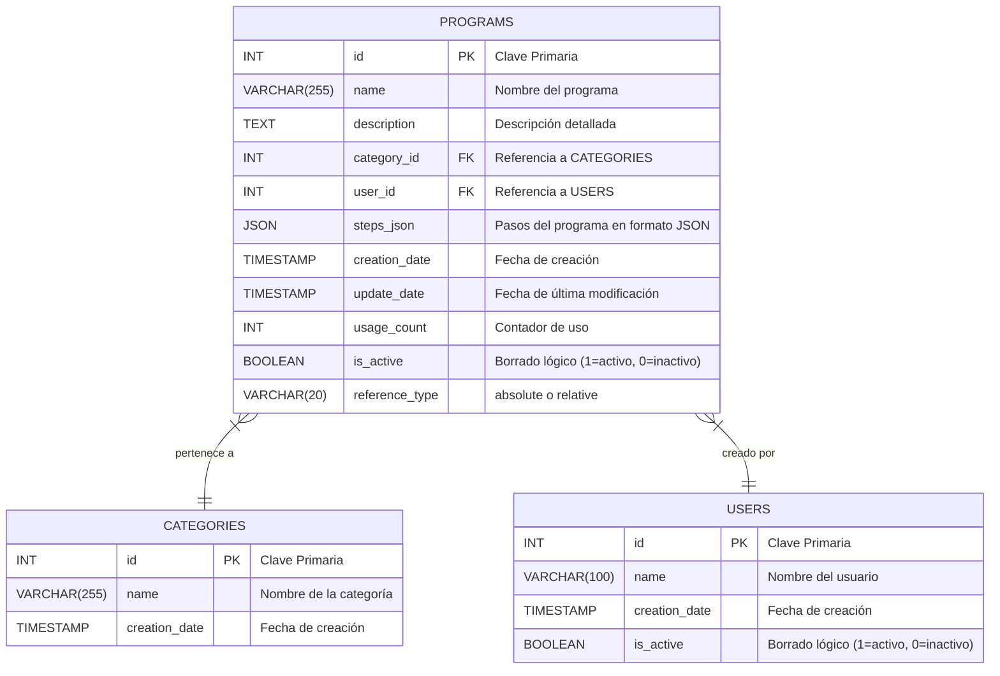

# Documentación de la Base de Datos

Este documento describe el esquema de la base de datos utilizada por el microservicio, el motor y las relaciones entre las tablas.

## 1. Motor de Base de Datos

- **Sistema**: **MySQL**
- **Librería de Conexión**: `mysql-connector-python`
- **Gestión de Conexión**: El acceso se gestiona a través de un singleton simple en `app.core.db` para reutilizar conexiones.

## 2. Diagrama del Esquema (ERD)

El siguiente diagrama Mermaid ilustra las tablas principales y sus relaciones.

## 3. Descripción de Tablas

### Tabla: `categories`

Almacena las categorías para agrupar los programas de cocción.

| Columna | Tipo de Dato | Restricciones | Descripción |
| :--- | :--- | :--- | :--- |
| `id` | `INT` | `PRIMARY KEY`, `AUTO_INCREMENT` | Identificador único de la categoría. |
| `name` | `VARCHAR(255)` | `NOT NULL`, `UNIQUE` | Nombre de la categoría (ej. "Carnes", "Pescados"). |
| `creation_date` | `TIMESTAMP` | `DEFAULT CURRENT_TIMESTAMP`| Fecha y hora de creación del registro. |

---

### Tabla: `users`

Almacena las personas que crean programas. El cliente web pide elegir uno la primera vez que se abre la aplicación y lo recuerda en `localStorage`.

| Columna | Tipo de Dato | Restricciones | Descripción |
| :--- | :--- | :--- | :--- |
| `id` | `INT` | `PRIMARY KEY`, `AUTO_INCREMENT` | Identificador único del usuario. |
| `name` | `VARCHAR(100)` | `NOT NULL`, `UNIQUE` | Nombre del usuario (ej. "Jon"). |
| `creation_date` | `TIMESTAMP` | `DEFAULT CURRENT_TIMESTAMP`| Fecha y hora de creación del registro. |
| `is_active` | `BOOLEAN` / `TINYINT(1)` | `DEFAULT 1` | Para borrado lógico. 1 para activo, 0 para inactivo. |

La clave foránea desde `programs` impide borrar un usuario que tenga programas, y por eso existe `is_active`: un usuario que ya no cocina se desactiva, no se elimina.

No se guarda nada más que el nombre. La identidad es autodeclarada — el usuario se elige de un desplegable, sin contraseña — así que un rol no podría hacerse cumplir y un PIN sería fricción en cada guardado.

---

### Tabla: `programs`

Contiene los programas de cocción con todos sus detalles y pasos.

| Columna | Tipo de Dato | Restricciones | Descripción |
| :--- | :--- | :--- | :--- |
| `id` | `INT` | `PRIMARY KEY`, `AUTO_INCREMENT` | Identificador único del programa. |
| `name` | `VARCHAR(255)` | `NOT NULL` | Nombre descriptivo del programa. |
| `description` | `TEXT` | `NULL` | Explicación más detallada del programa. |
| `category_id` | `INT` | `FOREIGN KEY(categories.id)` | ID de la categoría a la que pertenece. |
| `user_id` | `INT` | `NOT NULL`, `FOREIGN KEY(users.id)` | ID del usuario que creó el programa. |
| `steps_json` | `JSON` | `NOT NULL` | Array de objetos JSON que define los pasos de cocción. Cada paso hace una sola cosa: `action`, `temperature`, `position`, `rotation` o `time`. Un paso con solo `time` es una **espera**. |
| `creation_date` | `TIMESTAMP` | `DEFAULT CURRENT_TIMESTAMP`| Fecha y hora de creación del registro. |
| `update_date` | `TIMESTAMP` | `NULL` | Fecha de la última actualización. |
| `usage_count` | `INT` | `DEFAULT 0` | Cuántas veces se ha utilizado el programa. |
| `is_active` | `BOOLEAN` / `TINYINT(1)` | `DEFAULT 1` | Para borrado lógico. 1 para activo, 0 para inactivo. |
| `reference_type` | `VARCHAR(20)` | `DEFAULT 'absolute'` | Cómo se interpreta el campo `position` de cada paso. `"absolute"`: la posición es el objetivo fijo 0-100%. `"relative"`: la posición es un delta (puede ser negativo) que se suma a la posición de la parrilla en el momento de iniciar la ejecución del programa, y se clampa a 0-100%.

El nombre del creador no se guarda aquí: se lee de `users` mediante el `JOIN` que hacen los endpoints de programas, así que renombrar un usuario cambia el creador que se muestra en todos sus programas. La columna `creator_name` que hacía ese trabajo antes ya no existe.
