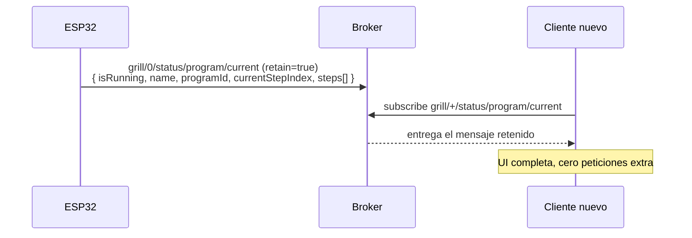

# Estado del programa en ejecución (en memoria)

El objetivo es tener los **detalles completos del programa en curso** (nombre, pasos, paso actual) para pintarlos en la interfaz, incluso si el usuario abre la aplicación a mitad de una cocción.

## Cómo funciona hoy: no hay caché, hay retained

La solución no es una caché con invalidación, ni una petición de detalles al ESP32, ni una consulta a la API. Es una única propiedad del protocolo MQTT:

> El ESP32 publica el programa **completo** en `grill/{id}/status/program/current` **con el flag `retain`**.

El broker guarda el último mensaje retenido de ese topic y se lo entrega automáticamente a cualquier cliente en cuanto se suscribe. Un cliente nuevo recibe el programa entero sin pedir nada.



## Implementación

`src/contexts/RunningProgramsContext.tsx` es todo el mecanismo:

- Una única suscripción con comodín, `grill/+/status/program/current`, cubre las dos parrillas.
- El estado es `RunningPrograms`: `{ 0: RunningProgram | null, 1: RunningProgram | null }`.
- `parseGrillIndex(topic)` saca el índice del topic para saber a qué parrilla pertenece el mensaje.
- Si llega `{ "isRunning": false }`, la entrada de esa parrilla se pone a `null` — y si ya era `null` se devuelve el estado anterior tal cual, para no provocar un re-render inútil.
- Si `isRunning` es `true`, el payload **se guarda entero**: es exactamente lo que la UI necesita.

Consumidores: `isProgramRunning(programId)` (¿está corriendo este programa, y en qué parrilla?) y `isAnyProgramRunning()`.

### Por qué importa el orden de suscripción

`useMqtt.subscribe()` registra el handler local **antes** de llamar a `client.subscribe()`. Es deliberado: el mensaje retenido llega inmediatamente después de la confirmación de suscripción, y con el orden inverso se perdería justo el mensaje que da sentido a todo esto.

## Contenido del payload

Publicado por `ProgramManager::publish_program_status()` en el firmware:

```json
{
  "isRunning": true,
  "name": "Chuletón",
  "programId": 123,
  "currentStepIndex": 1,
  "referenceType": "absolute",
  "steps": [
    { "time": 300, "temperature": 220, "position": 40 },
    { "time": 600, "position": 20, "stepStartUnix": 1755781200 }
  ]
}
```

- Los campos sin valor de cada paso se **omiten**, no se envían a `null`.
- `stepStartUnix` (timestamp UTC de inicio) aparece **solo en el paso actual**. Es lo que permite calcular el tiempo restante correctamente aunque el cliente acabe de conectarse: sin él habría que asumir que el paso empezó al recibir el mensaje.

## Limpieza

- Al terminar o cancelarse el programa, el firmware publica `{ "isRunning": false }` (también retenido) y el contexto pone la entrada a `null`.
- El estado vive en RAM del navegador: recargar la página lo borra, y la suscripción lo repuebla sola con el mensaje retenido.
- No hay nada que invalidar. Si un programa se **edita** en la API mientras se está ejecutando, el cambio no afecta a la ejecución en curso: el ESP32 corre la copia que recibió por MQTT y tiene en su RAM, que es justamente la versión que se está cocinando.

## Nota histórica

Versiones anteriores documentaban un flujo de *cache miss* con topics `get_running_program_details` / `running_program_details_response`. **Eso ya no existe** ni en el firmware ni en el cliente. El firmware sí conserva `grill/{id}/action/request/program_status`, que fuerza una republicación del estado, pero el cliente no lo usa: con el mensaje retenido no le hace falta.
