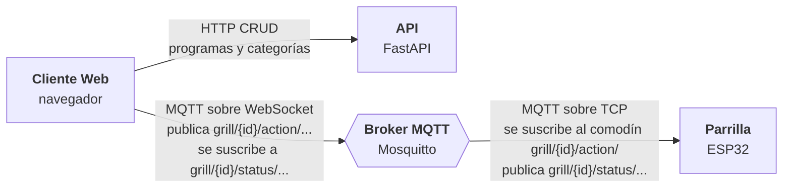
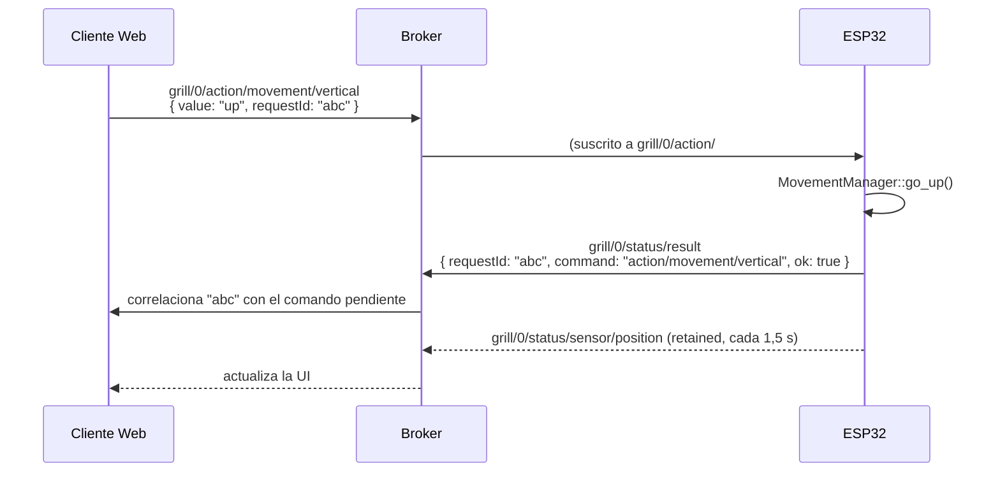
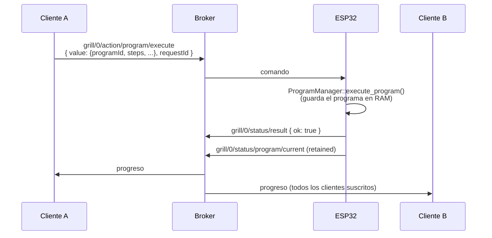
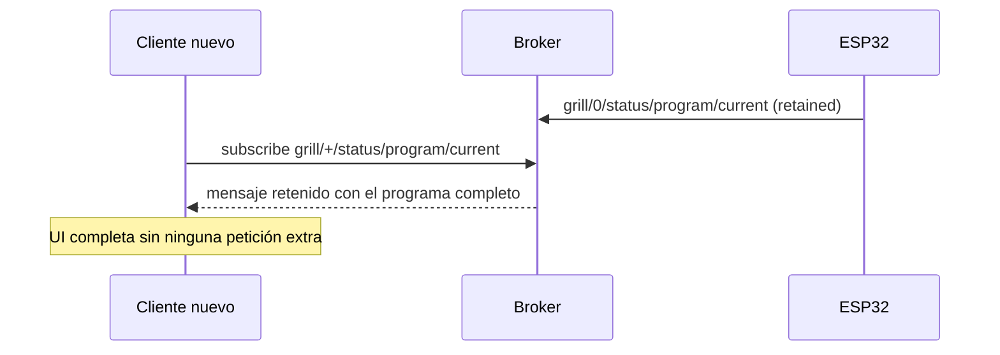

# Arquitectura de Comunicación y Flujos MQTT

Este documento describe la comunicación en tiempo real entre la **Parrilla (ESP32)** y el **Cliente Web (navegador)**. La **API (FastAPI)** no participa en estos flujos: solo sirve el CRUD HTTP de programas y categorías (ver [api.md](api.md)).

> **Fuente de verdad:** los nombres de topic, payloads y códigos de error los define el firmware en
> `GaztaindiGrill-ESP32/lib/Grill/GrillConstants.h`. El espejo del cliente vive en
> `src/constants/mqtt.ts` y `src/constants/commandErrors.ts`. Este documento explica *cómo encajan*;
> si alguna vez difiere de esos ficheros, mandan ellos.

## Diagrama de alto nivel



- **HTTP/S:** solo datos persistidos (CRUD) entre **Cliente Web** y **API**.
- **MQTT:** todo lo demás — comandos manuales, ejecución de programas, telemetría de sensores, modo single/dual y estado de conexión — **exclusivamente entre Cliente Web y Parrilla**.
- El cliente se conecta por **WebSocket** (`ws://` o `wss://`, puerto 1884/8884 por defecto, configurable con `NEXT_PUBLIC_MQTT_*` — ver `src/hooks/useMqtt.tsx`). El ESP32 se conecta por TCP normal.

---

## Convención de topics

Hay dos familias de topics, y el prefijo se construye distinto en cada lado del contrato:

| | Topics globales | Topics por parrilla |
|---|---|---|
| **Forma** | `grill/<algo>` (plano) | `grill/{id}/<algo>` donde `{id}` es `0` o `1` (`NUM_GRILLS = 2`) |
| **Ejemplos** | `grill/connection`, `grill/restart`, `grill/current_mode` | `grill/0/action/movement/vertical`, `grill/1/status/sensor/position` |
| **En el firmware** | La constante ya **incluye** el prefijo: `TOPIC_LWT = "grill/connection"` | La constante va **sin** prefijo (`"action/movement/vertical"`); `GrillMQTT::parse_topic()` antepone `grill/{id}/` al publicar |
| **En el cliente** | La constante va **sin** prefijo (`GLOBAL.LWT = 'connection'`) y cada llamada escribe `` `grill/${TOPICS.GLOBAL.LWT}` `` | Igual: la constante va desnuda y cada llamada escribe `` `grill/${grillIndex}/${topic}` `` |

Consecuencia práctica: **constantes que parecen iguales en los dos ficheros no son comparables directamente** — hay que comparar el topic completo resultante. Y como en el cliente no existe un helper central que construya el topic (el prefijo se reescribe a mano en ~15 sitios), un prefijo mal puesto es un bug de *ese* punto de llamada, no de las constantes.

Dentro de una parrilla, el segundo nivel separa la dirección:

- `action/...` → **cliente → ESP32** (comandos). El ESP32 se suscribe con un comodín: `grill/{id}/action/#`.
- `status/...` → **ESP32 → cliente** (telemetría y estado).

---

## Envoltorio petición/respuesta

Los comandos **no** son "dispara y olvida". Todo lo que el cliente publica en un topic `action/...` (o en un topic global de sistema) va envuelto así:

```json
{ "value": "up", "requestId": "9f2c-..." }
```

- `value` es el payload real: un escalar (`"up"`, `"50"`) o un objeto entero (el programa a ejecutar).
- `requestId` lo genera `useMqtt.sendCommand()` y se guarda en un mapa de comandos pendientes (con TTL de 30 s, para que una respuesta que nunca llega no filtre memoria).

El ESP32 contesta **siempre en `grill/{id}/status/result`** (o `grill/status/result` para comandos de sistema), con QoS 1 y **sin retain** — es una respuesta, no estado, y replicarla al siguiente cliente que conecte mostraría un toast obsoleto:

```json
{ "requestId": "9f2c-...", "command": "action/movement/vertical", "ok": true }
{ "requestId": "9f2c-...", "command": "action/movement/rotation", "ok": false, "error": "no_rotor" }
```

Reglas del protocolo, tal y como están implementadas:

- **El éxito es "lo que no falló".** El despachador del firmware llama a `reply_ok()` automáticamente si el handler terminó sin responder (`Grill::reply_ok_if_unanswered`). Los handlers solo escriben sus fallos.
- **`defer()`** silencia ese ok automático cuando la respuesta llega más tarde: un cambio de modo que se resuelve varias iteraciones de `loop()` después, o un `set_rotation` que primero tiene que subir la parrilla a una altura segura.
- **`requestId: "EVERYONE"`** es el centinela para respuestas dirigidas a *todos* los clientes conectados, no al que preguntó. Es también lo que el firmware asigna cuando el payload **no** trae envoltorio (un `mosquitto_pub` a pelo, o un mensaje retenido que el propio ESP32 se relee al arrancar); en ese caso no se envía ok automático, porque no hay nadie esperando.
- El cliente se suscribe a `grill/+/status/result` **y** a `grill/status/result`, porque `+` casa exactamente un nivel y no cubriría los comandos de sistema.
- Un resultado cuyo `requestId` no está en el mapa de pendientes y no es `EVERYONE` se ignora en silencio: es el comando de otro usuario, y un toast que no corresponde a ninguna acción propia solo confunde.



---

## Tabla de topics

### Globales (sistema)

| Topic | Dirección | Retained | Payload | Propósito |
| --- | --- | --- | --- | --- |
| `grill/connection` | ESP32 → Cliente | sí (LWT) | `online` / `offline` | Last Will and Testament. Es como el cliente sabe que la parrilla está viva. |
| `grill/reset_status` | ESP32 → Cliente | sí | `resetting` / `ready` | El sistema está recalibrando; el cliente muestra `ResettingOverlay` y el firmware ignora comandos mientras dure. |
| `grill/current_mode` | ESP32 → Cliente | sí | `single` / `dual` | Modo actual. Retenido para que un cliente nuevo lo tenga al conectar; el propio ESP32 se resuscribe a él para releerlo al arrancar. |
| `grill/request_current_mode` | Cliente → ESP32 | no | `"requestCurrentMode"` | Pide una publicación del modo actual. `CurrentModeContext` lo repite cada segundo (en modo `silent`) hasta conocer el modo. |
| `grill/request_mode_change` | Cliente → ESP32 | no | `single` / `dual` | Solicita cambiar de modo. La respuesta va diferida (`defer`): puede acabar en `mode_change_denied`. |
| `grill/restart` | Cliente → ESP32 | no | `"restart"` | Reinicia el microcontrolador. Responde `ok` *antes* de reiniciar, porque `ESP.restart()` no retorna. |
| `grill/emergency_stop` | Cliente → ESP32 | no | `"stop"` | Parada de emergencia de las dos parrillas. |
| `grill/time` | ESP32 → Cliente | sí | unix time UTC | Hora del ESP32 tras sincronizar NTP. **Hoy el cliente no se suscribe a este topic.** |
| `grill/status/result` | ESP32 → Cliente | no | ver envoltorio | Respuesta a un comando de sistema (los publica un `GrillMQTT` con índice `-1`). |

### Por parrilla — `action/...` (Cliente → ESP32)

| Topic | `value` | Propósito |
| --- | --- | --- |
| `grill/{id}/action/movement/vertical` | `up` / `down` / `stop` | Movimiento vertical continuo del actuador lineal. |
| `grill/{id}/action/movement/rotation` | `clockwise` / `counter_clockwise` / `stop` | Rotación continua, **sin seguro de altura**: la da alguien mirando la parrilla. Solo la parrilla 0 tiene rotor; en la 1 devuelve `no_rotor`. |
| `grill/{id}/action/movement/set_position` | `0`–`100` | Ir a una posición concreta. |
| `grill/{id}/action/movement/set_rotation` | `0`–`359` | Ir a un ángulo concreto. Si la parrilla está demasiado baja para inclinarse sin tocar la brasa, **sube primero, gira y vuelve**, y la respuesta se difiere hasta que el giro arranca. Fuera de rango → `rotation_out_of_range`; sin rotor → `no_rotor`; si no se puede asegurar → `rotation_unsafe`. |
| `grill/{id}/action/movement/reset_rotation` | `""` | Pone el cero del rotor en la inclinación actual, sin reiniciar. Republica `status/sensor/rotation` a `0`. Sin rotor → `no_rotor`; con un programa o un movimiento en marcha → `rotor_busy`. |
| `grill/{id}/action/program/execute` | objeto programa (ver abajo) | Ejecuta un programa completo. |
| `grill/{id}/action/program/cancel` | `""` | Cancela el programa en curso. Si no hay ninguno → `no_program_running`. |
| `grill/{id}/action/request/program_status` | — | Fuerza una publicación de `status/program/current`. **El cliente no lo usa hoy**; existe en firmware y constantes como herramienta de depuración manual. |

El payload de `execute` (`value`) es el objeto que arma `src/app/programs/list/page.tsx`:

```json
{
  "programId": 123,
  "name": "Chuletón",
  "description": "...",
  "creatorName": "...",
  "usageCount": 4,
  "referenceType": "absolute",
  "steps": [
    { "position": 40 },
    { "time": 300 },
    { "rotation": 90 },
    { "action": "flip" }
  ]
}
```

Cada paso hace **una sola cosa**. `time` a solas es un **paso de espera**, no un retardo pegado a un movimiento: los pasos que mueven la parrilla no llevan tiempo y avanzan en cuanto llegan a su destino. El firmware resuelve el tipo en el orden `action` → `temperature` → `position` → `rotation` → `time`, y se salta un paso que no traiga ninguno.

Ojo: la API guarda los pasos como **string JSON** (`steps_json`); el cliente hace `JSON.parse` antes de mandarlo, así que por MQTT `steps` viaja como array de verdad. `referenceType` `relative` hace que el firmware ancle las posiciones a la posición actual al arrancar el programa; si el encoder no responde en ese momento, el programa **no arranca** y contesta `encoder_not_answering`.

### Por parrilla — `status/...` (ESP32 → Cliente)

| Topic | Retained | Payload | Propósito |
| --- | --- | --- | --- |
| `grill/{id}/status/sensor/position` | sí | número | Posición del encoder (0–100). Se publica cada `SENSOR_UPDATE_INTERVAL` (1,5 s). |
| `grill/{id}/status/sensor/rotation` | sí | número | Ángulo del rotor. |
| `grill/{id}/status/sensor/temperature` | sí | número | Temperatura en °C (PT100). |
| `grill/{id}/status/program/current` | **sí** | objeto (ver abajo) | Estado **completo** del programa en ejecución. |
| `grill/{id}/status/result` | no | ver envoltorio | Respuesta a un comando de esa parrilla. |
| `grill/{id}/log` | no | texto | Trazas del firmware (`GrillMQTT::print()` espeja aquí todo lo que va al serie). |

`status/program/current` es el topic central de la experiencia multiusuario. Lo publica `ProgramManager::publish_program_status()` **con retain**, y lleva el programa entero, no solo el progreso:

```json
{
  "isRunning": true,
  "name": "Chuletón",
  "programId": 123,
  "currentStepIndex": 1,
  "referenceType": "absolute",
  "steps": [
    { "position": 40 },
    { "time": 300 },
    { "action": "flip" },
    { "position": 20, "stepStartUnix": 1755781200 }
  ]
}
```

- Los campos vacíos de un paso se **omiten** (el firmware solo escribe los que tienen valor).
- `stepStartUnix` se inyecta **solo en el paso actual**: es el timestamp UTC en que empezó, y es lo que permite al cliente pintar una cuenta atrás correcta aunque se conecte a mitad.
- Cuando no hay programa corriendo el payload es simplemente `{ "isRunning": false }`.

---

## Flujos principales

### Flujo 1: ejecución de un programa



1. El cliente publica el programa completo en `grill/0/action/program/execute`.
2. El ESP32 lo guarda en RAM (**no** en flash: un reinicio pierde el programa en curso, es un compromiso deliberado para no desgastar la flash) y arranca la máquina de estados.
3. Con cada avance publica `status/program/current` retenido.
4. Todos los clientes suscritos actualizan su UI. `RunningProgramsContext` se suscribe con comodín a `grill/+/status/program/current`, así que cubre las dos parrillas con una sola suscripción.

### Flujo 2: sincronización de un cliente nuevo

Aquí **no hay petición de detalles**. Como `status/program/current` va retenido y lleva el programa entero, el broker se lo entrega al cliente nuevo en cuanto se suscribe, sin que este tenga que pedir nada ni consultar la API:



Detalle de implementación en el cliente: `useMqtt.subscribe()` registra el handler local **antes** de suscribirse en el broker, precisamente para no perderse el mensaje retenido que llega inmediatamente después.

### Flujo 3: control manual

`ControlPad` → `useGrillCommands` → `sendCommand()`, que antepone `grill/{grillIndex}/` y envuelve el payload. Los topics son los cuatro de `action/movement/...`. El hook valida rangos en cliente (posición 0–100, rotación 0–360, temperatura 0–500) antes de publicar, y el firmware vuelve a validar en su frontera.

`handleSetTemperature` hoy **no publica nada**: muestra un aviso de "pendiente de implementación en el firmware".

### Flujo 4: cambio de modo single/dual

1. `CurrentModeContext` publica `grill/request_current_mode` cada segundo hasta recibir el modo (en modo `silent`, para no encadenar toasts).
2. La página `/mode` publica `grill/request_mode_change` con `single` o `dual`.
3. El firmware **no responde en el acto**: `modeManager->requestMode()` solo registra la intención y llama a `defer()`. La decisión se toma en una iteración posterior del `loop()`, y ahí sale un `ok` o un `mode_change_denied`.
4. El nuevo modo se publica retenido en `grill/current_mode`.

### Flujo 5: desconexión y reinicio

- **Caída de la parrilla**: el broker publica el LWT `offline` en `grill/connection`. El cliente lo detecta y deja de mostrar estado obsoleto. Si se intenta publicar un comando con la parrilla `offline`, `useMqtt.publish()` avisa con un toast en vez de fallar en silencio.
- **Recalibración**: `grill/reset_status` pasa a `resetting` y vuelve a `ready`. Mientras está en `resetting`, el firmware rechaza cualquier comando con el error `resetting`.

---

## Códigos de error

El firmware envía **códigos**, nunca texto de interfaz: así reescribir un mensaje no obliga a reflashear la parrilla. La traducción a castellano vive en `src/constants/commandErrors.ts`.

| Código | Cuándo |
| --- | --- |
| `invalid_json` | El programa recibido en `execute` no deserializa. |
| `no_steps` | El programa no trae array `steps`. |
| `no_rotor` | Comando de rotación dirigido a una parrilla sin rotor (la 1). |
| `rotation_out_of_range` | `set_rotation` fuera de `[0, 360)`. |
| `mode_change_denied` | El cambio de modo no se pudo aplicar. |
| `no_program_running` | `cancel` sin programa en curso. |
| `rotation_unsafe` | Un giro con destino que no se puede asegurar: el encoder de posición no contesta, o la subida previa no llegó dentro de `MOVEMENT_TIMEOUT`. |
| `rotor_busy` | `reset_rotation` con un programa en marcha o un movimiento sin terminar. |
| `encoder_not_answering` | Programa `relative` que no puede anclar su posición inicial. |
| `resetting` | Cualquier comando recibido durante una recalibración. |

`resetting` es el único que **no** tiene una constante `ERROR_*` en `GrillConstants.h`: el firmware reutiliza `PAYLOAD_RESETTING` como código de error. Es correcto, pero es la clase de detalle que una comparación mecánica entre los dos ficheros marca como divergencia.

---

## Depuración

```bash
mosquitto_sub -v -t 'grill/#'
```

Para simular un comando a mano, recuerda el envoltorio (aunque el firmware también acepta payloads planos, tratándolos como `EVERYONE`):

```bash
mosquitto_pub -t 'grill/0/action/movement/vertical' -m '{"value":"up","requestId":"manual-1"}'
```

Con `NEXT_PUBLIC_MQTT_SERVER=localhost` el cliente activa además algunos atajos de simulación (ver `src/utils/mqttSimulators.ts` y la rama `isLocalhost` de `useGrillCommands`), que publican estado *impostando al ESP32* en vez de mandarle órdenes.
